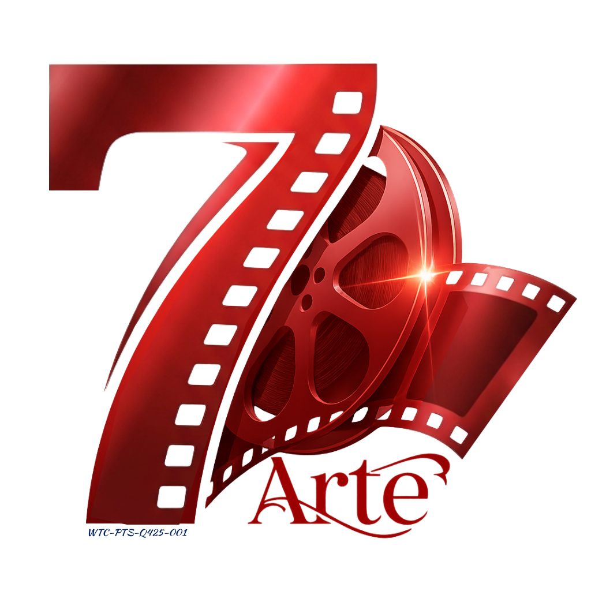

# 7ª Arte — Plataforma de Streaming (PWA)



**7ª Arte** é um protótipo funcional de uma plataforma de streaming de filmes desenvolvido como projeto interno da **We, The Coders**. O objetivo principal é testar sincronia, performance, colaboração e capacidade técnica da equipa dentro de um ciclo curto de desenvolvimento.

A aplicação é construída em **arquitetura MVC-like**, inclui **frontend React**, **backend em PHP**, **autenticação JWT**, **gestão administrativa**, **integração com Cloudinary** e funciona como **PWA responsiva**, com foco no tema escuro para uma experiência cinematográfica.

---

## Sumário

* [Descrição](#descrição)
* [Funcionalidades Principais](#funcionalidades-principais)
* [Requisitos Não Funcionais](#requisitos-não-funcionais)
* [Stack Tecnológica](#stack-tecnológica)
* [Estrutura do Projeto](#estrutura-do-projeto)
* [Marcos do Desenvolvimento](#marcos-do-desenvolvimento)
* [Equipe](#equipe)
* [Licença](#licença)

---

## Descrição

A plataforma permite que utilizadores naveguem, pesquisem, filtrem e assistam filmes de forma fluida. Além disso, inclui um **back office administrativo** para gestão de filmes, categorias e conteúdos, com autenticação separada para administradores e utilizadores comuns.

O projeto faz parte de um **Teste de Sincronia (PTS-Q425-001)**, com duração prevista de **1 semana**, e tem como finalidade validar a viabilidade técnica, a integração entre equipa e a utilização de tecnologias relevantes para futuras aplicações da WTC.

---

## Funcionalidades Principais

### Frontend

* Listagem de filmes com capas, títulos e notas
* Busca por título
* Filtragem por categoria, ano e classificação
* Página de detalhes com sinopse, trailer e avaliações
* Player de vídeo embutido
* Comentários e avaliações por utilizadores autenticados
* Download de filmes (quando aplicável)

### Backend

* CRUD de filmes com integração ao **Cloudinary**
* Autenticação JWT/Firebase (login, registro, recuperação e redefinição de senha)
* API estruturada em MVC-like
* Envio de e-mails (PHPMailer)

### Área Administrativa

* Login exclusivo de administradores
* Dashboard com gestão de filmes
* Inserção, edição e remoção de conteúdos

---

## Requisitos Não Funcionais

* Interface responsiva
* Tempo de carregamento inferior a 5 segundos
* Estrutura modular e de fácil expansão
* Proteção contra XSS e SQL Injection
* Armazenamento otimizado via Cloudinary
* Acessibilidade (contraste, navegação por teclado, legendas)

---

## Stack Tecnológica

### Frontend

* HTML5
* CSS3
* JavaScript (ES6+)
* TypeScript
* React

### Backend

* PHP 7.4+
* Bramus Router
* PHPMailer
* Firebase / PHP-JWT
* DotEnv

### Infraestrutura

* MySQL
* Cloudinary
* Git/GitHub

### Arquitetura

* MVC-like
* PWA responsiva

### Identidade Visual

* **Cores**

  * Fundo: #0D0D0D
  * Principal: #FFFFFF
  * Secundário: #A5A5A5
  * Acento: #C00018
* **Tipografia**: Poppins
* **Tema**: Dark/Light (foco no Dark)

---

##  Estrutura do Projeto

```
├── server/
│   ├── controllers/
│   ├── config/
│   ├── core/
│   ├── models/
│   ├── public/
│   │  ├── index.php
│   │  └── .htaccess
│   ├── vendor/
│   ├── composer.json
│   └── .env
├── client/
│   ├── assets/
│   │  ├── img/
│   │  ├── js/
│   │  └── css/
│   ├── components/
│   ├── pages/
│   │  ├── backoffice/
│   │  └── usuarios/
└── README.md
```

## Marcos do Desenvolvimento

| Fase                  | Entrega                   | Data  |
| --------------------- | ------------------------- | ----- |
| Setup e Arquitetura   | Estrutura base + Git      | Dia 1 |
| Backend & BD          | Rotas, Autenticação, CRUD | Dia 5 |
| Frontend & Integração | Telas + API               | Dia 6 |
| Testes & Entrega      | Protótipo funcional       | Dia 7 |
| Documentação          | Arquivos em md            | Dia 7 |

---

## Equipe

| Nome                | Papel                              |
| ------------------- | ---------------------------------- |
| **Manuel Filho**    | Arquiteto de Software / Full-Stack |
| **Abraão Sala**     | Back-End Principal                 |
| **Joaquim Pataqui** | Front-End (UI/UX)                  |
| **José Sebastião**  | Back-End                           |
| **Santos Lemba**    | Full-Stack (BD & UI)               |
